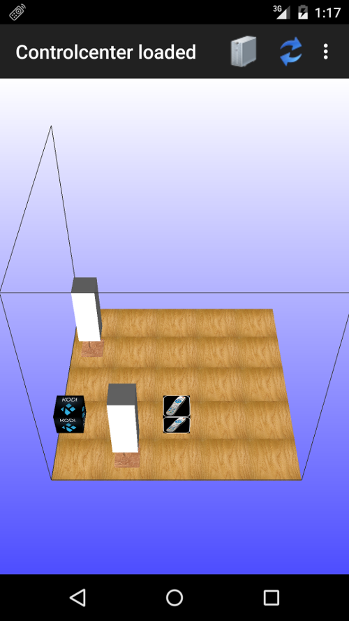
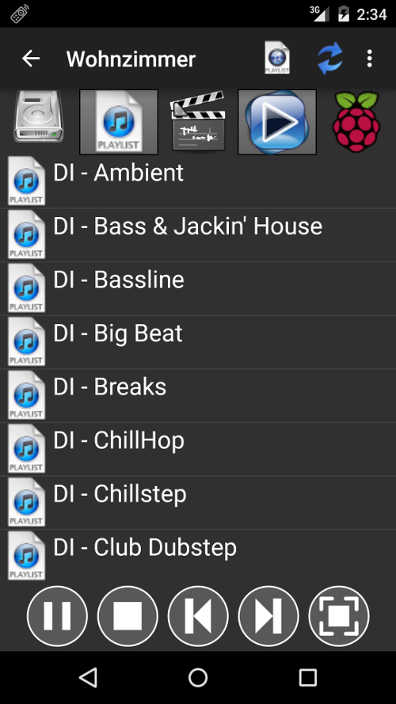

SmartHome
=======================

This repository contains java projects to setup a simple SmartHome. 
The java-based application runs for example on a rasperry pi and controlls the music-player (mplayer) or controlls switches by sending codes by the gpios of the raspi to a 433 MHz sender.
The SmartHome is configured by a xml-file that contains all controllable units.

## XML configuration
The java application requires a xml-file. The xml defines the SmartHome and contains all controllable units. The following listing shows an example xml-configuration.

```xml
<?xml version="1.0"?>
<SmartHome>
	<!-- Define the port of the web-interface -->
	<ControlCenter port="5061">

		<!-- The optionally ground plot is used by the android-client -->
		<!-- The client visualizes the SmartHome in an opengl-scene-->
		<GroundPlot>
			<Wall>
				<Point x="0" y="0" z="0"/>
				<Point x="0" y="0" z="5"/>
				<Point x="5" y="0" z="5"/>
				<Point x="5" y="0" z="0"/>
			</Wall>
			<Wall>
				<Point x="0" y="0" z="0"/>
				<Point x="0" y="0" z="5"/>
				<Point x="0" y="5" z="5"/>
				<Point x="0" y="5" z="0"/>
			</Wall>
		</GroundPlot>

		<!-- Scripts are used to define events for any trigger -->
		<Script trigger="trigger.light">
			<Event unitID="switch.light1">
				<Parameter key="state" value="on"/>
			</Event>
			<Event unitID="switch.light2">
				<Parameter key="state" value="on"/>
			</Event>
		</Script>

		<!-- Define jobs by the cron syntax. They can call any trigger -->
		<TimeTrigger cronjob="30 6 * * *">
			<Trigger triggerID="trigger.light"/>
		</TimeTrigger>
	</ControlCenter>

	<!-- List of internet switches -->
	<!-- The family-code and switch-number indicates a 433MHz rc switch -->
	<!-- Setting the switch requires a 433MHz sender connected to the raspi gpios -->
	<InternetSwitch id="switch.light1"
			familyCode="11111"
			switchNumber="3"  
			name="Livingroom" 
			x="1.5" y="0.5" z="0" 
			type="floorlamp"
			readonly="false"/>
	<InternetSwitch id="switch.light2"
			familyCode="11111" 
			switchNumber="2"  
			name="Bedroom" 
			x="0.5" y="3.5" z="0" 
			type="floorlamp"
			readonly="false"/>

	<!-- Define a media-server that supports file-browsing and playlists -->
	<!-- Requires mplayer or omxplayer to play any music or video file -->
	<MediaServer id="media.living"
			location="/media/hdd/" 
			playlistLocation="/media/hdd/.pls/" 
			type="remote" 
			name="Wohnzimmer" 
			x="2.5" y="0.5" z="1.5" 
			thumbnailWorker="false"/>

	<!-- Define any command-line action -->
	<!-- This example starts the kodi media-server -->
	<!-- The client-action is used for the android-client to start the kodi remote control -->
	<CommandAction id="action.kodi"
			name="Kodi"
			type="Execute Kodi media server"
			command="/usr/bin/kodi-standalone"
			clientAction="yatse://command/show/remote"
			thumbnail="/home/pi/kodi.png"
			logFile="/home/pi/Logs/kodi.log"
			x="0.5" y="0.5" z="1.5"/>

	<!-- Define access by managed users-->
	<!-- A user can be admin witch allows access to everything -->
	<User avatar="" 
			id="1333524613105917070" 
			name="admin" 
			password="secure" 
			role="ADMIN"/>

	<!-- The normal user has the role USER and has no access by default -->
	<User avatar="" 
			id="2601749788507583561" 
			name="Anonymous" 
			password="anon" 
			role="USER"/>

	<!-- A UnitAccess allows the given user to access the defined unit -->
	<UnitAccess unit="switch.light1" user="2601749788507583561"/>
	<UnitAccess unit="media.living" user="2601749788507583561"/>

	<!-- The web-api requires a session-token for each call -->
	<!-- The following two sessions define a token for the admin and one for the user -->
	<Session id="2265740024538433441" token="admin_token" user="1333524613105917070"/>
	<Session id="1351990467740299448" token="user_token" user="2601749788507583561"/>

</SmartHome>
```

## Android client

The android client visualizes and controlls the SmartHome application. The example-configuration looks like the following screenshot.



